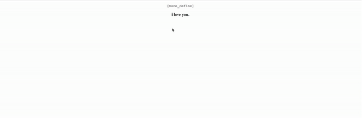
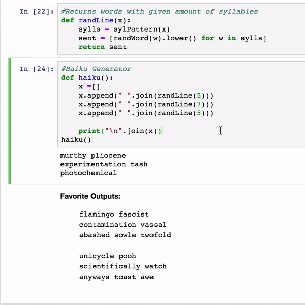

# art-attack
Place to put tiny fun projects I work on

## more_define (Dec 2018)
Building off the theme of "Break it down," this project allows you to click on a word within a sentence and replace it with the word's definition

Runs JQuery + Python on local flask server, leverages nltk for nlp + beautiful soup for definition lookup

## haiku_generator (Feb 2018)
Python NLTK generated haikus.Outputs are always absurd, often nonsense, and mostly entertaining

